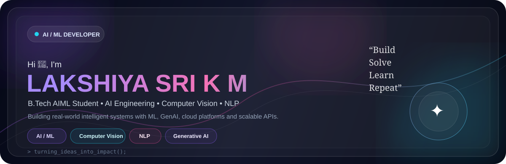

 

 

<table>
<tr>
<td width="50%" valign="top">

## 🧠 About Me

I'm a **B.Tech Artificial Intelligence & Machine Learning student** at Rajalakshmi Engineering College with a strong interest in building practical AI systems.

I work across:

- 🤖 Machine Learning & Generative AI
- 👁️ Computer Vision
- 🧠 NLP
- ⚙️ Data Engineering & MLOps
- ☁️ Cloud-based AI applications
- 🚀 Full-stack intelligent systems

> **Curiosity drives progress, and AI turns possibilities into reality.**

</td>

<td width="50%" valign="top">

## ⚡ Tech Stack

**Languages**

`Python` `Java` `C` `SQL` `JavaScript`

**AI / ML**

`TensorFlow` `Transformers` `Generative AI` `NLP` `Computer Vision`

**Frameworks**

`FastAPI` `LangChain` `Flask`

**Tools & Platforms**

`Azure ML` `AWS` `Google Colab` `Jupyter` `Hugging Face` `Docker` `Git` `MLflow`

</td>
</tr>
</table>

 

## 🚀 Featured Projects

<table>
<tr>
<td width="33%" valign="top">

### 🚗 ResQAI

**AI-Powered Accident Detection System**

Real-time accident detection using YOLO-based deep learning with automated emergency alerts and live location mapping.

**Stack:**  
`Python` `OpenCV` `TensorFlow` `YOLO` `Flask` `Twilio` `Google Maps`

<a href="https://github.com/LAKSHIYA24">View Project →</a>

</td>

<td width="33%" valign="top">

### 📄 LinkedMind

**AI Resume Analyzer & Job Role Prediction**

NLP-powered resume analysis system that predicts top job roles, generates professional bios and tracks resume history.

**Stack:**  
`Python` `Flask` `NLTK` `PyPDF2` `JavaScript`

<a href="https://github.com/LAKSHIYA24">View Project →</a>

</td>

<td width="33%" valign="top">

### 📊 Leads CRM

**Campaign Management System**

Full-stack CRM designed to manage leads, campaigns and customer interactions with lead scoring, dashboards and REST APIs.

**Stack:**  
`FastAPI` `MySQL` `React.js` `REST API`

<a href="https://github.com/LAKSHIYA24">View Project →</a>

</td>
</tr>
</table>

 

## 💼 Experience

<table>
<tr>
<td width="18%" align="center">

**2025**

</td>
<td>

### Approtech R&D Solutions — Web Development Intern

Developed a full-stack web application integrating a machine-learning-based Loan Approval Prediction System. Worked across preprocessing, model inference, backend API integration and deployment using FastAPI and cloud platforms.

</td>
</tr>

<tr>
<td align="center">

**2025 — Present**

</td>
<td>

### IEEE CIS Society — CV Head

Developed and optimized deep-learning computer vision models using **OpenCV, TensorFlow and PyTorch**, including CNN architectures such as **ResNet and YOLO** for real-time object detection.

</td>
</tr>
</table>

 

## 🏆 Achievements

| | Achievement |
|---|---|
| 🥇 | **Winner — SIH Internal Hackathon 2025** |
| 🏅 | **Finalist — InternEzy Hackathon 2025** |
| 🎯 | **Event Management Head — Phoenix, REC** |
| 👁️ | **CV Head — IEEE CIS Society, REC** |

 

## 🎓 Education

**Rajalakshmi Engineering College, Chennai**  
Bachelor of Technology — **Artificial Intelligence & Machine Learning**  
**CGPA: 8.85 / 10.0** · Sept 2023 – Present

 

## 📊 GitHub Activity

> Your **real GitHub contribution graph, repositories, pinned projects, achievements and activity feed are already rendered by GitHub itself** on your profile.  
> This README intentionally does **not** fake streaks, contribution counts or repository statistics.

 

## 🌐 Languages

`English` · `Tamil` · `Hindi`

 

### ✦ Building intelligent solutions, one project at a time ✦

 

<a href="mailto:lakshiyasrikm05@gmail.com">Let's Connect →</a>

