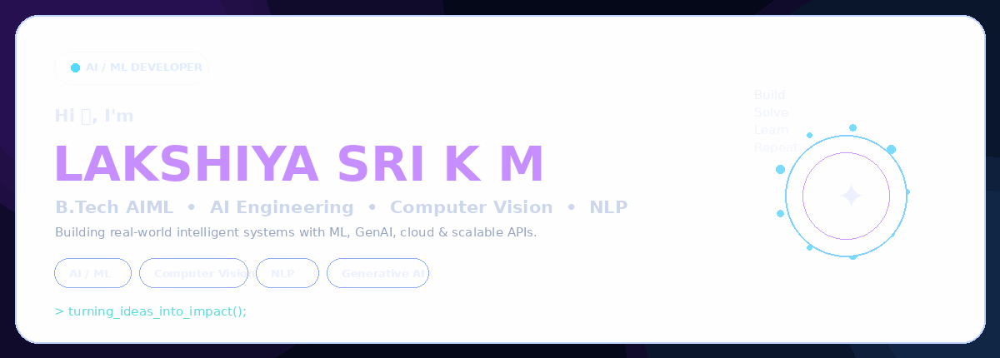

<div align="center">



<br/>

<a href="mailto:lakshiyasrikm05@gmail.com">

</a>
<a href="https://www.linkedin.com/in/lakshiya-sri-k-m-ba91772a2/">

</a>
<a href="https://github.com/LAKSHIYA24">

</a>

</div>

<br/>

<table>
<tr>
<td width="50%" valign="top">

## 🧠 About Me

**B.Tech Artificial Intelligence & Machine Learning** student at Rajalakshmi Engineering College.

I enjoy building practical AI systems across **Machine Learning, Computer Vision, NLP, Generative AI, cloud platforms and scalable APIs.**

```text
→ Learn
→ Build
→ Experiment
→ Deploy
→ Repeat
```

> *Curiosity drives progress, and AI turns possibilities into reality.*

</td>

<td width="50%" valign="top">

## ⚡ Tech Stack

<div align="center">

<br/><br/>
<br/><br/>
<br/><br/>
<br/><br/>


</div>

<p align="center">
<sub>TensorFlow • Transformers • GenAI • NLP • Computer Vision • LangChain • MLOps • MLflow</sub>
</p>

</td>
</tr>
</table>

<br/>

## 🚀 Featured Projects

<table>
<tr>
<td width="33%" valign="top">

### 🚗 ResQAI

**AI-Powered Accident Detection**

YOLO-based real-time accident detection with automated emergency alerts and live location mapping.

`Python` `OpenCV` `TensorFlow` `YOLO` `Flask` `Twilio`

</td>

<td width="33%" valign="top">

### 📄 LinkedMind

**AI Resume Analyzer**

Predicts top job roles, generates professional bios and analyzes resume skills using NLP.

`Python` `Flask` `NLTK` `PyPDF2` `GenAI`

</td>

<td width="33%" valign="top">

### 📊 Leads CRM

**Campaign Management System**

Full-stack CRM for leads, campaigns and customer interactions with scoring, dashboards and REST APIs.

`FastAPI` `React.js` `MySQL` `REST API`

</td>
</tr>
</table>

<br/>

## 💼 Experience

### 🔹 Approtech R&D Solutions — Web Development Intern
**Jun 2025 – Jul 2025**

Full-stack web application integrating a machine-learning Loan Approval Prediction System, including preprocessing, model inference, backend API integration and cloud deployment.

### 🔹 IEEE CIS Society — CV Head
**Oct 2025 – Present**

Computer vision work using **OpenCV, TensorFlow and PyTorch**, including CNN architectures such as **ResNet and YOLO** for real-time object detection.

<br/>

## 🏆 Achievements

<div align="center">

| 🥇 SIH Internal Hackathon 2025 | 🏅 InternEzy Hackathon 2025 | 🎯 Phoenix, REC | 👁️ IEEE CIS |
|:---:|:---:|:---:|:---:|
| **Winner** | **Finalist** | **Event Management Head** | **CV Head** |

</div>

<br/>

## 🎓 Education

**Rajalakshmi Engineering College, Chennai**  
B.Tech — **Artificial Intelligence & Machine Learning**  
**CGPA: 8.85 / 10.0** · Sept 2023 – Present

<br/>

## 📈 GitHub

<div align="center">

<a href="https://github.com/LAKSHIYA24">

</a>

<a href="https://github.com/LAKSHIYA24">

</a>

</div>

<br/>

<div align="center">

### ✦ BUILD • LEARN • CREATE • REPEAT ✦

<a href="mailto:lakshiyasrikm05@gmail.com">Let's Connect →</a>

</div>
